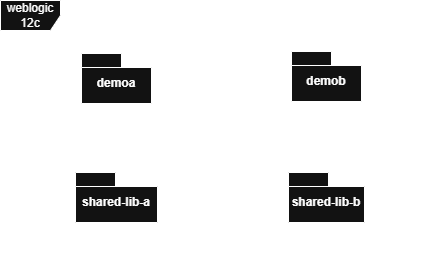

# demosharedlib
POC Weblogic 12c Shared Libraries



## Prerequisites
- Java JDK 1.8
- Maven 3.9.9
- Weblogic 12c (for deployment only)

## Order to build, package and deploy
1. sharedliba
2. sharedlibb
3. demoa
4. demob

## Compile and Package

### sahredliba
```bash
cd sharedliba
mvn clean package
```

### sahredlibb
```bash
cd sharedlibb
mvn clean package
```

### demoa
```bash
cd demoa
mvn clean package
```

### demob
```bash
cd demob
mvn clean package
```

## Deploy to weblogic

1. Deploy saredliba/target/shared-lib-a.war as Library
2. Deploy saredlibb/target/shared-lib-b.war as Library
3. Deploy demoa/target/demoa.war as Web application
4. Deploy demob/target/demob.war as Web application

## Test applications on Web Browser

Application Demo A: http://<ip>:7001/demoa/client-info

Application Demo B: http://<ip>:7001/demob/client-info


